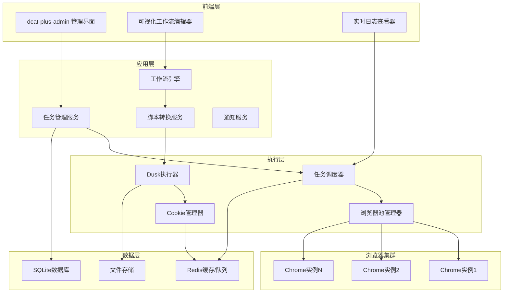

# Design Document

## Overview

本设计文档描述了基于 dcat-plus-admin 和 Laravel Dusk 的自动化任务管理平台的技术架构。系统采用模块化设计，支持可视化工作流创建、智能浏览器池管理、Cookie自动维护和多种任务执行模式。

## Architecture

### 系统架构图



### 核心组件架构

#### 1. 任务管理层
- **TaskManager**: 任务CRUD操作和状态管理
- **WorkflowEngine**: 可视化工作流解析和执行
- **ScriptConverter**: 青龙脚本转换为Dusk脚本
- **ScheduleManager**: 基于Cron的任务调度

#### 2. 执行引擎层
- **BrowserPoolManager**: 浏览器实例池管理
- **DuskExecutor**: Dusk脚本执行器
- **CookieManager**: 智能Cookie管理和维护
- **LogManager**: 实时日志记录和截图管理

#### 3. 数据存储层
- **SQLite**: 主数据库（任务、用户、日志等）
- **Redis**: 缓存、队列、会话存储
- **FileSystem**: 截图、脚本文件存储

## Components and Interfaces

### 1. 任务管理组件

#### TaskModel
```php
class Task extends Model
{
    protected $fillable = [
        'name', 'description', 'type', 'status', 'cron_expression',
        'script_content', 'workflow_data', 'domain', 'is_exclusive',
        'login_config', 'env_vars', 'notification_config'
    ];
    
    protected $casts = [
        'workflow_data' => 'array',
        'login_config' => 'array',
        'env_vars' => 'array',
        'notification_config' => 'array'
    ];
}
```

#### TaskService
```php
interface TaskServiceInterface
{
    public function createTask(array $data): Task;
    public function updateTask(int $id, array $data): Task;
    public function executeTask(int $id): TaskExecution;
    public function getNextRunTime(Task $task): Carbon;
    public function toggleTaskStatus(int $id): bool;
}
```

### 2. 工作流引擎组件

#### WorkflowNode
```php
abstract class WorkflowNode
{
    protected string $id;
    protected string $type;
    protected array $config;
    protected array $connections;
    
    abstract public function execute(BrowserContext $context): NodeResult;
    abstract public function validate(): ValidationResult;
    abstract public function toDuskCode(): string;
}
```

#### 预定义节点类型
- **NavigateNode**: 页面导航
- **ClickNode**: 元素点击
- **TypeNode**: 文本输入
- **WaitNode**: 等待操作
- **ConditionNode**: 条件判断
- **LoopNode**: 循环操作
- **ScreenshotNode**: 截图操作

### 3. 浏览器池管理组件

#### BrowserPool
```php
class BrowserPool
{
    private array $instances = [];
    private int $maxInstances = 5;
    
    public function getBrowser(Task $task): BrowserInstance;
    public function releaseBrowser(BrowserInstance $browser): void;
    public function getPoolStatus(): array;
    public function optimizeAllocation(Task $task): BrowserInstance;
}
```

#### BrowserInstance
```php
class BrowserInstance
{
    private RemoteWebDriver $driver;
    private array $activeTabs = [];
    private string $primaryDomain;
    private bool $isExclusive = false;
    
    public function newTab(Task $task): TabSession;
    public function closeTab(string $tabId): void;
    public function isAvailable(): bool;
    public function getResourceUsage(): array;
}
```

### 4. Cookie管理组件

#### CookieManager
```php
class CookieManager
{
    public function saveCookies(string $domain, array $cookies, ?string $account = null): void;
    public function loadCookies(string $domain, ?string $account = null): array;
    public function isCookieValid(string $domain, ?string $account = null): bool;
    public function refreshCookies(Task $task): bool;
    public function cleanExpiredCookies(): void;
}
```

## Data Models

### 数据库表结构

#### tasks 表
```sql
CREATE TABLE tasks (
    id INTEGER PRIMARY KEY AUTOINCREMENT,
    name VARCHAR(255) NOT NULL,
    description TEXT,
    type ENUM('browser', 'api') DEFAULT 'browser',
    status ENUM('enabled', 'disabled') DEFAULT 'enabled',
    cron_expression VARCHAR(255) NOT NULL,
    script_content TEXT,
    workflow_data JSON,
    domain VARCHAR(255),
    is_exclusive BOOLEAN DEFAULT FALSE,
    login_config JSON,
    env_vars JSON,
    notification_config JSON,
    created_at TIMESTAMP DEFAULT CURRENT_TIMESTAMP,
    updated_at TIMESTAMP DEFAULT CURRENT_TIMESTAMP
);
```

#### task_executions 表
```sql
CREATE TABLE task_executions (
    id INTEGER PRIMARY KEY AUTOINCREMENT,
    task_id INTEGER NOT NULL,
    status ENUM('running', 'success', 'failed') DEFAULT 'running',
    start_time TIMESTAMP DEFAULT CURRENT_TIMESTAMP,
    end_time TIMESTAMP NULL,
    duration INTEGER NULL,
    browser_instance_id VARCHAR(255),
    tab_id VARCHAR(255),
    error_message TEXT,
    screenshots JSON,
    FOREIGN KEY (task_id) REFERENCES tasks(id)
);
```

#### task_logs 表
```sql
CREATE TABLE task_logs (
    id INTEGER PRIMARY KEY AUTOINCREMENT,
    execution_id INTEGER NOT NULL,
    level ENUM('debug', 'info', 'warning', 'error') DEFAULT 'info',
    message TEXT NOT NULL,
    context JSON,
    screenshot_path VARCHAR(255),
    created_at TIMESTAMP DEFAULT CURRENT_TIMESTAMP,
    FOREIGN KEY (execution_id) REFERENCES task_executions(id)
);
```

#### cookies 表
```sql
CREATE TABLE cookies (
    id INTEGER PRIMARY KEY AUTOINCREMENT,
    domain VARCHAR(255) NOT NULL,
    account VARCHAR(255),
    cookie_data JSON NOT NULL,
    expires_at TIMESTAMP,
    last_used_at TIMESTAMP DEFAULT CURRENT_TIMESTAMP,
    is_valid BOOLEAN DEFAULT TRUE,
    created_at TIMESTAMP DEFAULT CURRENT_TIMESTAMP,
    updated_at TIMESTAMP DEFAULT CURRENT_TIMESTAMP,
    UNIQUE(domain, account)
);
```

#### browser_instances 表
```sql
CREATE TABLE browser_instances (
    id VARCHAR(255) PRIMARY KEY,
    status ENUM('idle', 'busy', 'error') DEFAULT 'idle',
    primary_domain VARCHAR(255),
    is_exclusive BOOLEAN DEFAULT FALSE,
    active_tabs JSON,
    resource_usage JSON,
    created_at TIMESTAMP DEFAULT CURRENT_TIMESTAMP,
    last_activity_at TIMESTAMP DEFAULT CURRENT_TIMESTAMP
);
```

## Error Handling

### 错误分类和处理策略

#### 1. 任务执行错误
- **网络错误**: 自动重试机制，最多3次
- **元素未找到**: 智能等待和备选选择器
- **登录失败**: 自动Cookie刷新和重新登录
- **浏览器崩溃**: 自动重启浏览器实例

#### 2. 系统级错误
- **资源不足**: 队列暂停和告警通知
- **数据库错误**: 事务回滚和数据恢复
- **文件系统错误**: 备用存储路径

#### 3. 错误恢复机制
```php
class ErrorHandler
{
    public function handleTaskError(TaskExecution $execution, Exception $error): void
    {
        // 记录错误日志
        $this->logError($execution, $error);
        
        // 根据错误类型决定重试策略
        if ($this->isRetryableError($error)) {
            $this->scheduleRetry($execution);
        } else {
            $this->markAsFailed($execution);
            $this->sendFailureNotification($execution);
        }
    }
}
```

## Testing Strategy

### 测试层次结构

#### 1. 单元测试
- 模型验证测试
- 服务类逻辑测试
- 工具类功能测试

#### 2. 集成测试
- 数据库操作测试
- 外部API调用测试
- 队列处理测试

#### 3. 端到端测试
- 完整任务执行流程测试
- 浏览器自动化测试
- 用户界面交互测试

#### 4. 性能测试
- 并发任务执行测试
- 浏览器池压力测试
- 内存泄漏检测

### 测试工具和框架
- **PHPUnit**: 单元测试和集成测试
- **Laravel Dusk**: 浏览器自动化测试
- **Mockery**: 模拟对象和依赖注入测试
- **Laravel Telescope**: 性能监控和调试

## 技术实现细节

### 1. 可视化工作流编辑器

#### 前端技术栈
- **Vue.js 3**: 响应式UI框架
- **Vue Flow**: 可视化流程图组件库
- **Element Plus**: UI组件库
- **Monaco Editor**: 代码编辑器

#### 工作流节点定义
```javascript
const nodeTypes = {
  navigate: {
    label: '页面导航',
    icon: 'el-icon-link',
    inputs: ['url'],
    outputs: ['success', 'error'],
    config: {
      url: { type: 'string', required: true },
      waitForLoad: { type: 'boolean', default: true }
    }
  },
  click: {
    label: '点击元素',
    icon: 'el-icon-mouse',
    inputs: ['selector'],
    outputs: ['success', 'error'],
    config: {
      selector: { type: 'string', required: true },
      waitTime: { type: 'number', default: 1000 }
    }
  },
  type: {
    label: '输入文本',
    icon: 'el-icon-edit',
    inputs: ['selector', 'text'],
    outputs: ['success', 'error'],
    config: {
      selector: { type: 'string', required: true },
      text: { type: 'string', required: true },
      clear: { type: 'boolean', default: true }
    }
  }
};
```

### 2. 青龙脚本转换引擎

#### 转换规则映射
```php
class ScriptConverter
{
    private array $conversionRules = [
        // HTTP请求转换
        'axios.get' => '$this->browser->visit({url})',
        'axios.post' => '$this->makeHttpRequest("POST", {url}, {data})',

        // DOM操作转换
        'document.querySelector' => '$this->browser->element({selector})',
        'element.click()' => '$this->browser->click({selector})',
        'element.value' => '$this->browser->type({selector}, {value})',

        // 延时操作转换
        'setTimeout' => '$this->browser->pause({milliseconds})',
        'sleep' => '$this->browser->pause({seconds} * 1000)',

        // 日志输出转换
        'console.log' => 'Log::info({message})',
        'print(' => 'Log::info({message})'
    ];

    public function convertScript(string $script, string $language): string
    {
        $parser = $this->getParser($language);
        $ast = $parser->parse($script);
        return $this->transformAst($ast);
    }
}
```

### 3. 浏览器池优化策略

#### 智能分配算法
```php
class BrowserAllocationStrategy
{
    public function allocateBrowser(Task $task): BrowserInstance
    {
        // 1. 检查是否有相同域名的空闲浏览器
        $sameDomainBrowser = $this->findSameDomainBrowser($task->domain);
        if ($sameDomainBrowser && !$task->is_exclusive) {
            return $sameDomainBrowser;
        }

        // 2. 检查是否有完全空闲的浏览器
        $idleBrowser = $this->findIdleBrowser();
        if ($idleBrowser) {
            return $idleBrowser;
        }

        // 3. 创建新的浏览器实例
        if ($this->canCreateNewInstance()) {
            return $this->createNewInstance($task);
        }

        // 4. 等待现有浏览器释放
        return $this->waitForAvailableBrowser($task);
    }
}
```

### 4. Cookie智能管理

#### Cookie生命周期管理
```php
class CookieLifecycleManager
{
    public function maintainCookies(): void
    {
        // 检查即将过期的Cookie
        $expiringCookies = $this->getExpiringCookies();

        foreach ($expiringCookies as $cookie) {
            $this->refreshCookie($cookie);
        }

        // 清理无效Cookie
        $this->cleanInvalidCookies();
    }

    private function refreshCookie(Cookie $cookie): void
    {
        $task = $this->createRefreshTask($cookie);
        $browser = app(BrowserPool::class)->getBrowser($task);

        try {
            $this->performLogin($browser, $cookie->login_config);
            $newCookies = $browser->driver->manage()->getCookies();
            $this->updateCookieData($cookie, $newCookies);
        } finally {
            app(BrowserPool::class)->releaseBrowser($browser);
        }
    }
}
```

### 5. 实时日志系统

#### WebSocket实时推送
```php
class LogStreamer
{
    public function streamLogs(TaskExecution $execution): void
    {
        $channel = "task.{$execution->id}.logs";

        // 监听日志事件
        Event::listen(TaskLogCreated::class, function ($event) use ($channel) {
            broadcast(new LogMessage($event->log))->toOthers();
        });

        // 推送截图更新
        Event::listen(ScreenshotCaptured::class, function ($event) use ($channel) {
            broadcast(new ScreenshotUpdate($event->screenshot))->toOthers();
        });
    }
}
```

### 6. 性能监控和优化

#### 资源使用监控
```php
class PerformanceMonitor
{
    public function monitorBrowserInstances(): void
    {
        foreach ($this->browserPool->getInstances() as $instance) {
            $metrics = [
                'memory_usage' => $this->getMemoryUsage($instance),
                'cpu_usage' => $this->getCpuUsage($instance),
                'tab_count' => count($instance->getActiveTabs()),
                'response_time' => $this->measureResponseTime($instance)
            ];

            $this->recordMetrics($instance->id, $metrics);

            // 检查是否需要重启
            if ($this->shouldRestart($metrics)) {
                $this->scheduleRestart($instance);
            }
        }
    }
}
```
